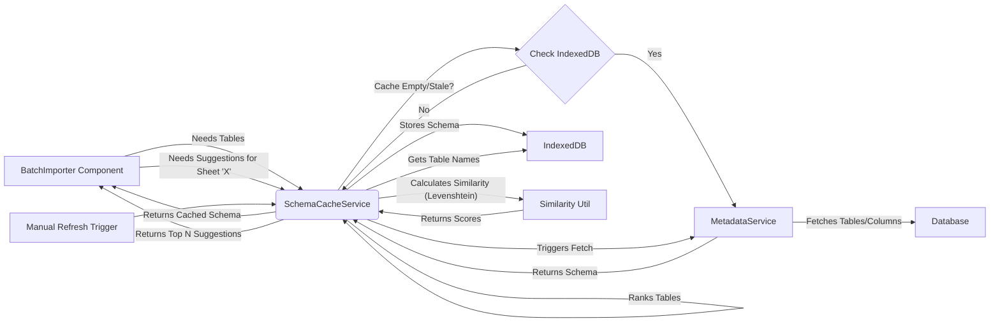
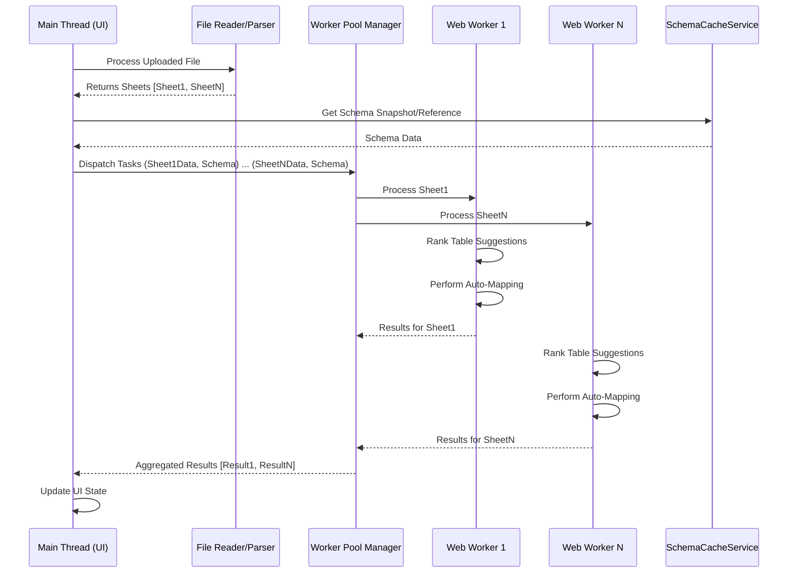

# Architecture: Batch Import Enhancements

This document outlines the architectural design for enhancing the batch import feature in PortfolioLens, focusing on table/column caching and ranking, parallel processing, field mapping suggestions, and state management.

## 1. Table/Column Metadata Caching and Ranking System

This system provides efficient access to database schema information (tables and columns) and ranks potential table matches against imported sheet names.

**1.1. Data Structures:**

```typescript
// Interface for a cached database column
interface CachedDbColumn {
  columnName: string;
  dataType: string; // e.g., 'text', 'numeric', 'timestamp with time zone'
  isNullable: boolean;
  columnDefault: string | null;
  // Add primary key info if fetchable easily, otherwise omit or default false
  isPrimaryKey?: boolean; 
}

// Interface for a cached database table
interface CachedDbTable {
  tableName: string;
  columns: CachedDbColumn[];
  // Optional: Add timestamp for cache freshness
  lastRefreshed?: number; 
}

// Interface for the overall schema cache structure
interface SchemaCache {
  tables: { [tableName: string]: CachedDbTable };
  lastRefreshed: number; // Timestamp of the last full refresh
}

// Interface for a ranked table suggestion
interface RankedTableSuggestion {
  tableName: string;
  similarityScore: number; // 0.0 to 1.0 (higher is better)
}
```

**1.2. Caching Strategy:**

*   **Storage:** Utilize client-side **IndexedDB** for persistent caching across browser sessions. This allows storing a larger amount of schema data than `localStorage` and provides asynchronous access, preventing UI blocking.
*   **Cache Location:** Manage the cache access through a dedicated `SchemaCacheService`. This service will abstract the IndexedDB interactions.
*   **Population/Refresh:**
    *   **Initial Population:** On application startup (or first access to the import feature), the `SchemaCacheService` checks IndexedDB. If the cache is empty or stale (e.g., older than 24 hours or a specific version mismatch), it fetches the full schema using the existing `MetadataService`.
    *   **Fetching:** The `MetadataService.getTables()` and `MetadataService.getColumns()` methods will be used. We should enhance `getColumns` to potentially fetch primary key information if feasible via `information_schema.key_column_usage` and `information_schema.table_constraints`.
    *   **Manual Refresh:** Provide a UI button (e.g., in import settings or admin panel) to trigger a full cache refresh via `SchemaCacheService`. This is crucial after database migrations.
    *   **Staleness:** Store a `lastRefreshed` timestamp or a schema version number in the cache. Compare this on load to determine if a refresh is needed.

**1.3. Similarity Scoring Algorithm:**

*   **Algorithm:** Use the **Levenshtein distance** algorithm to calculate the similarity between a sheet name and table names in the cache. Normalize the score to a 0.0 - 1.0 range (e.g., `1 - (distance / max(len1, len2))`).
*   **Implementation:** A utility function `calculateSimilarity(str1: string, str2: string): number` will implement this. Consider using a well-tested library (like `fast-levenshtein`) for efficiency.
*   **Ranking:** When suggestions are needed for a sheet, iterate through the cached table names, calculate the similarity score against the sheet name, and return the top N (e.g., 5) suggestions sorted by score (descending).

**1.4. Information Flow:**



## 2. Parallel Processing Strategy

To handle potentially many sheets in a batch import without blocking the UI, suggestion generation and initial processing should be done concurrently.

**2.1. Approach:**

*   **Web Workers:** Utilize a pool of Web Workers. Each worker can process one or more sheets independently.
    *   **Main Thread Role:** Reads the uploaded file (using `FileReader` or similar), splits it into individual sheets (data + sample rows), and dispatches tasks to the worker pool. It also manages the overall state and aggregates results.
    *   **Worker Role:** Receives sheet data (name, headers, sample rows) and a copy of (or access mechanism to) the necessary schema cache data. It performs:
        *   Table name suggestion ranking (using the similarity algorithm).
        *   Automatic header-to-field mapping.
        *   Sends results (suggestions, initial mapping) back to the main thread.
*   **Communication:** Use `postMessage` for communication between the main thread and workers. Define clear message types/interfaces for tasks and results.
*   **Fallback:** If Web Workers are complex to implement initially or in environments where they aren't supported, use asynchronous processing (`async`/`await` with `Promise.all`) combined with yielding (`setTimeout(0)`) periodically during heavy loops to prevent UI freezing. However, workers are the preferred approach for true parallelism.

**2.2. Data Flow (Web Worker Approach):**



## 3. Field Mapping System

This system handles the display of sample data, automatic mapping suggestions, and the workflow for creating new fields.

**3.1. Data Structures:**

```typescript
// Interface for a single sheet being processed
interface SheetProcessingState {
  sheetName: string;
  headers: string[];
  sampleData: Record<string, any>[]; // Array of row objects (e.g., 5 rows)
  selectedTable: string | null; // User-selected or top suggested table
  tableSuggestions: RankedTableSuggestion[];
  columnMappings: { [header: string]: ColumnMapping }; // Keyed by original header
  status: 'pending' | 'processing' | 'needsReview' | 'ready' | 'error';
  error?: string;
}

// Interface for mapping a single sheet header to a DB column
interface ColumnMapping {
  header: string; // Original sheet header
  sampleValue: any; // A sample value from the first few rows
  mappedColumn: string | null; // Target DB column name
  suggestedColumns: RankedTableSuggestion[]; // Top N column suggestions based on header name/type
  dataType: 'string' | 'number' | 'boolean' | 'date' | null; // Inferred data type
  action: 'map' | 'skip' | 'create'; // Action for this column
  newColumnInfo?: { // Details if action is 'create'
      columnName: string;
      sqlType: string; 
  };
}
```

**3.2. Logic Flow:**

1.  **Display:** For each sheet, display its name, sample data (first 5 rows), the suggested/selected target table, and a mapping table (headers vs. target columns).
2.  **Initial Auto-Mapping (Worker):**
    *   Fetch columns for the top suggested table (or selected table) from the `SchemaCacheService`.
    *   For each sheet `header`:
        *   Infer `dataType` from `sampleData` using `MetadataService.inferDataType`. This gives us the likely type of the source data (e.g., 'string', 'number', 'date').
        *   Filter the target table's columns to find those with a **compatible data type**. For example, a source 'number' could map to DB 'numeric', 'integer', 'float', etc. A source 'string' could potentially map to 'text', 'varchar', or even 'numeric'/'date' if parsing is intended (though initial suggestions should prioritize direct type matches).
        *   Calculate the similarity score (Levenshtein distance) between the sheet `header` and the `columnName` of each **type-compatible** database column.
        *   Rank these compatible columns based on their name similarity score (descending). These become the `suggestedColumns`.
        *   If a high-confidence match is found (high similarity score among top-ranked compatible columns), pre-populate `mappedColumn` and set `action: 'map'`. Otherwise, leave `mappedColumn` null and set `action: 'skip'` or 'needsReview'.
3.  **User Review/Modification:**
    *   Users can change the `selectedTable`. This triggers re-fetching columns and re-running auto-mapping for that sheet.
    *   Users can manually select a `mappedColumn` from the suggestions or the full column list for the table.
    *   Users can explicitly set `action: 'skip'` for a header.
    *   Users can trigger `action: 'create'`.
4.  **"Create New Field" Workflow:**
    *   User clicks "Create New Field" for a header.
    *   UI prompts for a `newColumnName` (defaults to the header name, possibly sanitized).
    *   The `dataType` is inferred from sample data. `MetadataService.getSqlTypeFromColumnType` converts this to a SQL type.
    *   The `newColumnInfo` is populated in the `ColumnMapping` state.
    *   *Crucially*, the actual `ALTER TABLE` command (using `MetadataService.createMissingColumns`) is **deferred** until the final "Save/Commit" step for the entire batch, not executed immediately.

## 4. State Management Approach

Manage the configuration and state of the batch import process, especially the mapping configurations before they are committed.

**4.1. State Structure:**

*   Use a dedicated slice/store within the application's state management library (e.g., Zustand, Redux Toolkit). If none exists, Zustand is often simpler for feature-specific state.
*   **State Slice:** `batchImportState`
    *   `fileInfo`: { name: string, size: number, type: string } | null
    *   `sheets`: { [sheetName: string]: SheetProcessingState }
    *   `globalStatus`: 'idle' | 'readingFile' | 'processingSheets' | 'review' | 'committing' | 'complete' | 'error'
    *   `commitProgress`: { processedSheets: number, totalSheets: number } | null
    *   `error`: string | null

**4.2. Actions / Reducers:**

*   `setFile(file)`: Updates `fileInfo`, resets `sheets`, sets `globalStatus` to 'readingFile'. Triggers file reading.
*   `setSheetData(sheetName, headers, sampleData)`: Adds/updates a sheet in `sheets` with initial data, sets its status to 'pending'.
*   `startProcessingSheets(schema)`: Sets `globalStatus` to 'processingSheets'. Dispatches tasks to workers.
*   `updateSheetSuggestions(sheetName, tableSuggestions, columnMappings)`: Updates a sheet's state with results from a worker, sets status to 'needsReview'.
*   `updateSheetMapping(sheetName, header, mappingUpdate)`: Updates a specific column mapping based on user interaction.
*   `setSelectedTable(sheetName, tableName)`: Updates the selected table, potentially triggers re-processing for that sheet.
*   `setGlobalStatus(status)`: Updates the overall process status.
*   `startCommit()`: Sets `globalStatus` to 'committing'. Triggers the commit process.
*   `updateCommitProgress(processed, total)`: Updates commit progress.
*   `setCommitComplete()`: Sets `globalStatus` to 'complete'.
*   `setError(errorMessage)`: Sets `error` and potentially `globalStatus` to 'error'.
*   `resetState()`: Clears the entire state slice.

**4.3. Save/Cancel Logic:**

*   **Intermediate State:** All mapping decisions (`selectedTable`, `columnMappings`, `action`, `newColumnInfo`) are stored *only* in the `batchImportState` slice. No database changes are made during the review phase.
*   **Cancel:** The `resetState()` action is called, discarding all changes and returning the UI to the initial state.
*   **Save (Commit):**
    1.  Triggered by the user. Sets `globalStatus` to 'committing'.
    2.  Iterate through sheets in the `sheets` state where `status === 'ready'` (or similar).
    3.  **Phase 1: Schema Modifications:**
        *   Collect all unique `newColumnInfo` across all sheets targeting the *same* table.
        *   For each table requiring new columns, call `MetadataService.createMissingColumns` *once* with all required columns for that table. This batches schema changes.
        *   Wait for all schema modifications to complete. If any fail, halt the commit and report errors.
        *   *Optional but recommended:* Trigger a `SchemaCacheService` refresh after successful schema changes.
    4.  **Phase 2: Data Import:**
        *   For each sheet, use the final `selectedTable` and `columnMappings` to prepare the data.
        *   Call the appropriate data import service/function (e.g., `ImportService.importData`), passing the prepared data and target table. This might involve batching inserts.
        *   Update `commitProgress`.
    5.  **Completion:** Once all sheets are processed, set `globalStatus` to 'complete'.

**4.4. State Flow Diagram:**

```mermaid
graph TD
    Start --> Idle;
    Idle -- Upload File --> ReadingFile;
    ReadingFile -- File Parsed --> ProcessingSheets;
    ProcessingSheets -- Worker Results --> Review;
    Review -- User Modifies Mappings --> Review;
    Review -- User Clicks Save --> Committing;
    Committing -- Schema Changes OK --> Committing;
    Committing -- Data Import Loop --> Committing;
    Committing -- All Sheets Done --> Complete;
    
    Review -- User Clicks Cancel --> Idle;
    ReadingFile -- Error --> ErrorState;
    ProcessingSheets -- Error --> ErrorState;
    Committing -- Error --> ErrorState;
    ErrorState -- User Acknowledges/Resets --> Idle;

    subgraph Commit Process
        direction TB
        C1[Start Commit] --> C2{Collect Schema Changes};
        C2 --> C3[Execute ALTER TABLE (per table)];
        C3 -- Success --> C4{Refresh Schema Cache?};
        C4 --> C5[Import Data (per sheet)];
        C5 --> C6[Update Progress];
        C6 -- More Sheets? --> C5;
        C6 -- No More Sheets --> C7[Finish Commit];
        C3 -- Failure --> C8[Commit Error];
        C5 -- Failure --> C8;
    end

    Committing --> Commit Process;
    Commit Process --> Complete;
    Commit Process --> ErrorState;

```

## 5. Implementation Recommendations

*   **Libraries:**
    *   Similarity: `fast-levenshtein` or similar.
    *   State Management: Zustand or Redux Toolkit (align with project standard).
    *   IndexedDB Wrapper: `idb` (by Jake Archibald) simplifies IndexedDB usage.
*   **Modularity:** Create distinct services/utilities:
    *   `SchemaCacheService`: Handles IndexedDB storage and retrieval of schema.
    *   `SimilarityService`: Contains the Levenshtein calculation.
    *   `MappingService` (enhance existing?): Contains logic for auto-mapping headers to columns.
    *   `BatchImportProcessor`: Manages Web Workers or async processing logic.
*   **Error Handling:** Implement robust error handling at each stage (file reading, worker processing, schema changes, data import) and reflect errors clearly in the UI and state.
*   **Testing:** Add unit tests for the similarity algorithm, mapping logic, and state management reducers/actions. Integration tests should cover the flow from file upload to commit.