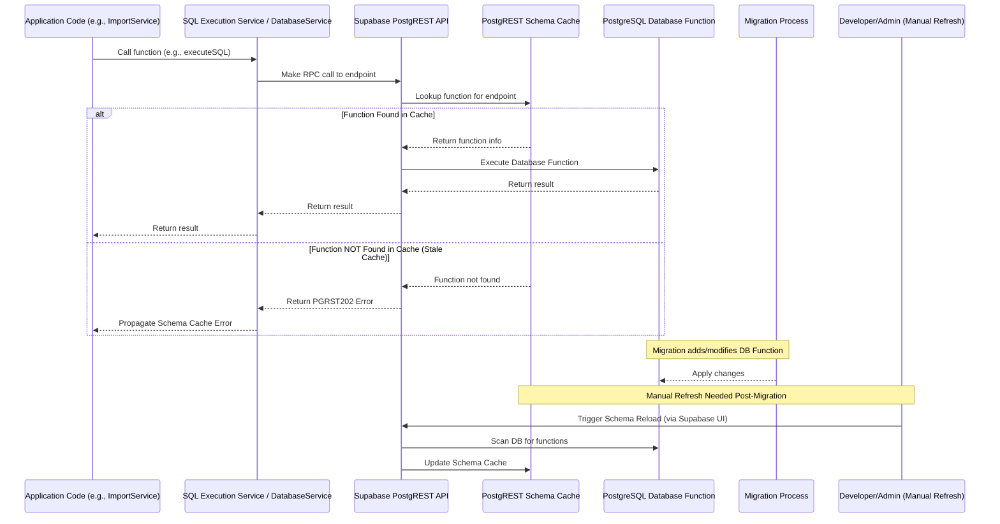

# PostgREST Schema Cache Management

## Overview

The PortfolioLens application relies on Supabase's PostgREST service to expose database functions as API endpoints. PostgREST maintains a schema cache that maps API endpoints to database functions. When new functions are added or existing functions are modified through migrations, this cache needs to be refreshed for the changes to be accessible via the API.

## Relationship with SQL Execution Framework

The Schema Cache Management system is closely integrated with the [SQL Execution Framework](./SQL_EXECUTION_FRAMEWORK.md) in the following ways:

- **Execution Chain Dependency**: The SQL Execution Framework relies on PostgREST's API layer to execute database functions. PostgREST, in turn, depends on an up-to-date schema cache to locate and execute these functions.
- **Error Handling Integration**: When the schema cache is stale, the SQL Execution Framework receives PGRST202 errors, which are then handled by the error detection and reporting mechanisms.
- **Resilience Strategy**: The primary fallback mechanism for schema cache errors is the documented error handling (detecting PGRST202) combined with the manual refresh process, rather than alternative execution paths within the SQL framework itself.

## Architectural Flow

The following diagram illustrates the interaction flow between application code, the SQL Execution Framework, PostgREST, and the schema cache:

## The Schema Cache Problem

**Root Issue**: PostgREST maintains a schema cache that is not automatically refreshed when database functions are added or modified.

**Symptoms**:
- "Could not find function in schema cache" errors (PGRST202)
- RPC calls failing silently
- Import operations failing
- Data processing functions not working

**Current Implementation**:
- A robust schema cache refresh utility (`schemaRefreshUtil.ts`) provides multiple methods to refresh the cache
- Automatic refresh is attempted after migrations and when PGRST202 errors are detected
- The system includes fallback to manual refresh instructions when automatic refresh fails

## Best Practices for Schema Cache Management

### After Running Migrations

1. **Always manually refresh the schema cache after running migrations**:
   - Go to the Supabase Dashboard
   - Navigate to SQL Editor -> Schema
   - Click the "Reload" button
   - Wait for confirmation that the reload is complete

2. **Verify the schema cache refresh**:
   - Try a simple operation that uses a database function
   - Check that no PGRST202 errors occur

### When Developing New Features

1. **Be aware of schema cache dependencies**:
   - Any new database function needs a schema cache refresh before it can be called via RPC
   - Changes to existing function signatures require a schema cache refresh

2. **Include schema cache refresh in your development workflow**:
   - After adding or modifying database functions, refresh the schema cache
   - Document schema cache dependencies in your code

### Architectural Best Practices

1. **Deployment Integration**:
   - Include schema cache refresh as a mandatory step in deployment checklists
   - Consider creating a deployment verification step that confirms the schema cache is up-to-date

2. **Testing Strategy**:
   - Implement automated post-migration smoke tests that specifically call recently modified/added RPC endpoints to verify cache state
   - Include schema cache verification in your CI/CD pipeline

3. **Documentation Standards**:
   - Add clear documentation within function definitions or related code regarding their reliance on RPC
   - Document potential cache issues and refresh requirements in function headers

### Error Handling

The application has been updated to properly handle and report schema cache errors:

1. **Error Detection and Recovery**:
   - PGRST202 errors are now specifically detected and trigger automatic schema cache refresh
   - The system implements back-off retry logic after schema refresh
   - Clear error messages indicate when a schema cache refresh is needed

2. **User-Friendly Messages**:
   - Error messages include instructions for refreshing the schema cache
   - Console logs provide detailed information about schema cache issues
   - Success/failure of automatic refresh attempts is clearly reported

## Architectural Resilience Recommendations

1. **Primary Resilience Mechanism**:
   - The current error detection (PGRST202) and user notification strategy serves as the primary resilience mechanism
   - This approach provides clear guidance to developers when schema cache issues occur

2. **Monitoring and Health Checks**:
   - Implement monitoring of PostgREST logs or application logs for frequent PGRST202 errors as an operational health check
   - Set up alerts for repeated schema cache errors to identify potential systemic issues

3. **Platform Updates**:
   - Periodically review Supabase/PostgREST updates for potential improvements in automatic cache invalidation
   - Stay informed about changes to the schema cache behavior in new versions

4. **Alternative Access Methods**:
   - Direct database connections could serve as a potential bypass in critical situations, but should be discouraged unless absolutely necessary
   - Note that bypassing PostgREST results in the loss of important features like role-based security, audit logging, and resource limits

## Troubleshooting

If you encounter schema cache issues:

1. **Check for PGRST202 errors in the console**:
   - Look for messages containing "SCHEMA CACHE ERROR"
   - These indicate that the schema cache needs to be refreshed

2. **Refresh the schema cache**:
   - Go to the Supabase Dashboard
   - Navigate to SQL Editor -> Schema
   - Click the "Reload" button

3. **Retry the operation**:
   - After refreshing the schema cache, retry the operation that failed
   - The operation should now succeed if the schema cache was the issue

## Technical Details

### How Schema Cache Refresh Works

1. **Manual Refresh**:
   - The Supabase Dashboard's "Reload" button sends a command to PostgREST to rebuild its schema cache
   - This process scans the database for functions and rebuilds the mapping of API endpoints

2. **Automatic Refresh Methods**:
   - **pg_notify Method**: The `pg_notify('pgrst', 'reload schema')` command attempts to trigger an automatic refresh
   - **REST API Method**: A more reliable approach that mimics the Dashboard's "Reload" button by calling the Supabase Management API
   - The system tries both methods in sequence for maximum reliability

3. **Schema Refresh Utility**:
   - The `schemaRefreshUtil.ts` utility provides functions to force schema cache refresh
   - It implements multiple approaches with retry logic and verification
   - Configuration options allow customizing retry attempts, delay, and logging level

### Implementation Notes

The application includes several mechanisms to handle schema cache issues:

1. **Automated Schema Cache Refresh**:
   - `schemaRefreshUtil.ts` provides functions to force schema cache refresh
   - `run-migrations.js` automatically attempts to refresh the schema cache after migrations
   - `supabaseMcp.ts` attempts to refresh the schema cache when PGRST202 errors are detected

2. **Error Detection and Recovery**:
   - PGRST202 errors trigger automatic schema cache refresh attempts
   - Back-off retry logic is implemented to handle temporary failures
   - Verification ensures the refresh was successful

3. **Error Propagation with Fallback**:
   - Schema cache errors are properly propagated up the call chain when automatic refresh fails
   - Clear error messages guide users through manual refresh steps
   - Console logs provide detailed information about refresh attempts

4. **Migration Integration**:
   - The `run-migrations.js` script automatically attempts to refresh the schema cache
   - It provides clear feedback on success or failure
   - Manual instructions are shown only if automatic refresh fails

## Future Architectural Recommendations

1. **Further Automation Enhancements**:
   - Explore additional Supabase Management API endpoints for more robust schema cache refresh
   - Investigate integration with CI/CD pipelines for automated verification

2. **Enhanced Health Checks**:
   - Develop more robust automated post-migration/deployment health checks that target RPC endpoints
   - Implement a comprehensive test suite that verifies all critical database functions are accessible via RPC

3. **API Design Patterns**:
   - Explore architectural patterns that minimize the frequency of changes to function signatures exposed via RPC
   - Consider versioning strategies for database functions to maintain backward compatibility
   - Evaluate the use of more generic function interfaces that can accommodate changes without signature modifications